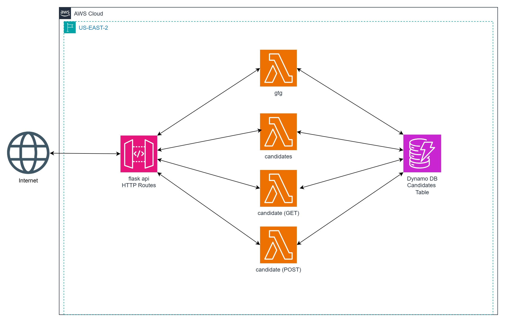
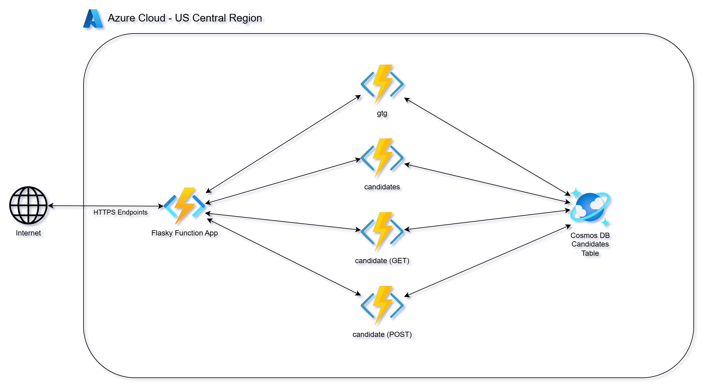
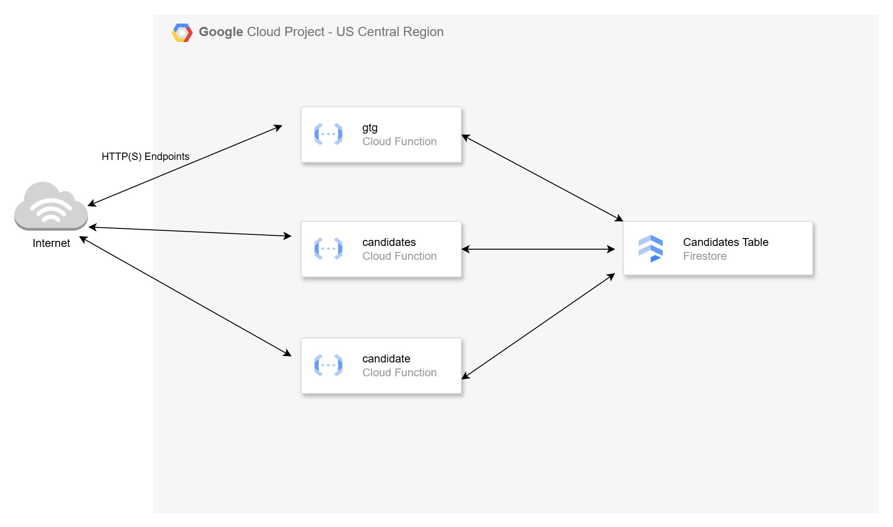

# Serverless HTTP Endpoints - AWS Lambdas, Azure Functions and GCP Cloud Functions

This video series complements the [Scaling in the Cloud](https://github.com/mamonaco1973/cloud-scaling-intro/blob/main/README.md) series. In that series, we deployed a simple microservice using Python and the Flask framework.

In this series, we will deploy Python-based serverless functions in **AWS**, **Azure**, and **GCP**. These are referred to as *Flask-like* or *flasky* throughout the project documentation. The goal is to deploy an identical API from the Cloud Scaling series using the native serverless features of each cloud provider.

By the end of this series, you will learn how to deploy simple Python-based HTTP endpoints as serverless functions across all three major cloud platforms using Terraform.

We will walk through the following tasks:

1. **Deploy Python Code** for microservices using serverless technologies:
   - **Lambdas** for AWS
   - **Azure Functions** for Azure
   - **Cloud Functions** for GCP

2. **Use a document database** for microservice data storage:
   - **DynamoDB** for AWS
   - **CosmosDB** for Azure
   - **Firestore** for GCP

3. **Configure HTTP endpoints** to invoke the serverless code:
   - **API Gateway** for AWS
   - **Function App** for Azure
   - **Cloud Run** for GCP

4. **Secure the HTTP endpoints**:
   - **IAM Integration** for AWS
   - **Function Keys** for Azure
   - **JWT Token** for GCP

5. **Clean up resources** by destroying all infrastructure created during the process.

## Quick Links

1. [Introduction Video](https://youtu.be/NPhu0byKj_A)
2. AWS Solution
   - [AWS Lambda HTTP Endpoints](https://youtu.be/Psf56Fvn62E)
   - [GitHub Project](https://github.com/mamonaco1973/aws-flasky-lambdas)
3. Azure Solution
   - [Azure HTTP Function App](https://youtu.be/aIi8dtXs4qk)
   - [GitHub Project](https://github.com/mamonaco1973/azure-flasky-function-app)
4. GCP Solution
   - [GCP HTTP Cloud Functions](https://youtu.be/vVeci5df3Wc)
   - [GitHub Project](https://github.com/mamonaco1973/gcp-flasky-cloud-functions)

## Introduction to Serverless Computing for HTTP Endpoints

Serverless computing is a cloud-computing execution model where the cloud provider dynamically manages the infrastructure, including server provisioning, scaling, and maintenance. This approach allows developers to focus entirely on writing and deploying code, without the need to manage or maintain underlying servers. A key use case for serverless computing is building and managing **HTTP endpoints**, making it a powerful solution for web applications, APIs, and microservices. Key characteristics of serverless computing include:

- **No Server Management**: Developers don't need to manage or provision servers; the cloud provider handles it all, allowing more focus on application logic.
- **Automatic Scaling**: Serverless applications, including HTTP endpoints, automatically scale up or down based on demand, ensuring consistent performance regardless of traffic volume.
- **Pay-As-You-Go**: Costs are based on actual usage (e.g., number of requests or function execution time), providing cost-efficiency for workloads with varying traffic patterns.

While serverless computing is commonly associated with **Functions-as-a-Service (FaaS)** platforms like AWS Lambda, Azure Functions, or Google Cloud Functions, it also integrates seamlessly with other services, such as API gateways for routing HTTP requests, managed databases for storage, and message queues for asynchronous processing. This makes serverless a versatile choice for building scalable and cost-effective HTTP-based solutions.

### **AWS**
1. **AWS Lambda**:
   - Runs code in response to HTTP requests.
   - Integrates directly with API Gateway for seamless endpoint creation.

2. **Amazon API Gateway**:
   - Fully managed service for creating and managing HTTP endpoints.
   - Routes incoming HTTP requests to AWS Lambda functions.
   - Supports REST APIs, HTTP APIs, and WebSocket APIs.

### **Azure**
1. **Azure Functions (Function Apps)**:
   - Azure's primary FaaS platform for executing code in response to HTTP requests.
   - Deployed as part of **Function Apps**, which group multiple functions together.
   - Supports automatic scaling and event-driven execution.
   - Built-in support for HTTP triggers, allowing each function to serve as an HTTP endpoint.
   - Secure endpoints with authentication, authorization, and HTTPS.

### **Google Cloud Platform (GCP)**
1. **Cloud Functions**:
   - Serverless FaaS platform with built-in HTTP trigger support.
   - Each function can serve as an HTTP endpoint.

2. **API Gateway**:
   - Not used in this project because Cloud Functions gives us everything we need for our simple HTTP endpoints
   - Adds features like better routing, authentication, rate limiting, and logging.

### Supported Serverless Languages

| Cloud Provider | Out-of-the-Box Languages                                     | Custom Runtimes                     |
|----------------|-------------------------------------------------------------|-------------------------------------|
| AWS Lambda     | Node.js, Python, Java, .NET (C#), Ruby, Go, PowerShell      | Any language via Runtime API        |
| Azure Functions| .NET (C#, F#), Python, Java, JavaScript, TypeScript, PowerShell | Any language via custom handlers    |
| GCP Functions  | Node.js, Python, Go, Java, .NET, Ruby, PHP                  | Any language via Cloud Run          |

## Securing Serverless APIs: Lightweight Methods

When deploying serverless HTTP endpoints, securing them is essential to protect sensitive data, prevent unauthorized access, and ensure only trusted clients or systems interact with your APIs. Cloud providers like AWS, Azure, and GCP offer native security methods for simple (lightweight) use cases:

### **AWS (Lambda with API Gateway)**
- **IAM Authentication:**
   - API Gateway supports IAM roles and policies for access control.
   - Clients authenticate requests using AWS SigV4 signing.
   - Ideal for internal applications or when clients use AWS SDKs.

---

### **Azure (Functions with HTTP Triggers)**
- **Function Keys:**
   - Access is managed using function keys (auto-generated or custom).
   - Keys are passed in the query string (`?code=...`) or headers for authentication.
   - Suitable for lightweight security but not intended for advanced access control.

---

### **GCP (Cloud Functions)**
- **Google Auth Token:**
   - Protect endpoints using a signed JWT (JSON Web Token).
   - Tokens can be retrieved via `gcloud auth` or by using a service account.
   - Ensures access is limited to authorized users or services within GCP.

By leveraging these provider-specific methods, you can implement security measures that align with your application's requirements and ensure a secure serverless environment.

## *Flasky* Endpoint Summary

- [AWS Source Code](https://github.com/mamonaco1973/aws-flasky-lambdas/tree/main/01-lambdas/code)
- [Azure Source Code](https://github.com/mamonaco1973/azure-flasky-function-app/blob/main/02-flasky/function_app.py)
- [GCP Source Code](https://github.com/mamonaco1973/gcp-flasky-cloud-functions/blob/main/01-cloudfunctions/code/main.py)

### `/gtg` (GET)
- **Purpose**: Health check.
- **Response**: 
  - `{"connected": "true", "instance-id": <instance_id>}` (if `details` query parameter is provided).
  - 200 OK with no body otherwise.

### `/candidate/<name>` (GET)
- **Purpose**: Retrieve a candidate by name.
- **Response**: 
  - Candidate details (JSON) with status `200`.
  - `"Not Found"` with status `404` if no candidate is found.

### `/candidate/<name>` (POST)
- **Purpose**: Add or update a candidate by name.
- **Response**: 
  - `{"CandidateName": <name>}` with status `200`.
  - `"Unable to update"` with status `500` on failure.

### `/candidates` (GET)
- **Purpose**: Retrieve all candidates.
- **Response**: 
  - List of candidates (JSON) with status `200`.
  - `"Not Found"` with status `404` if no candidates exist.
