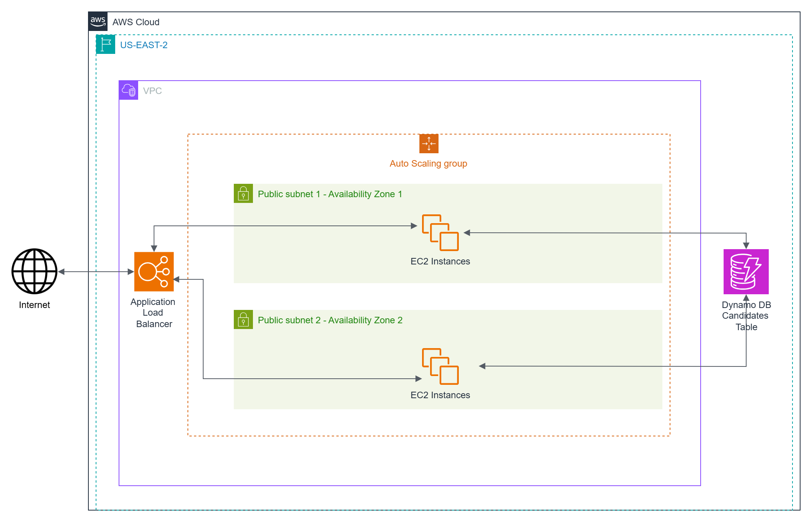
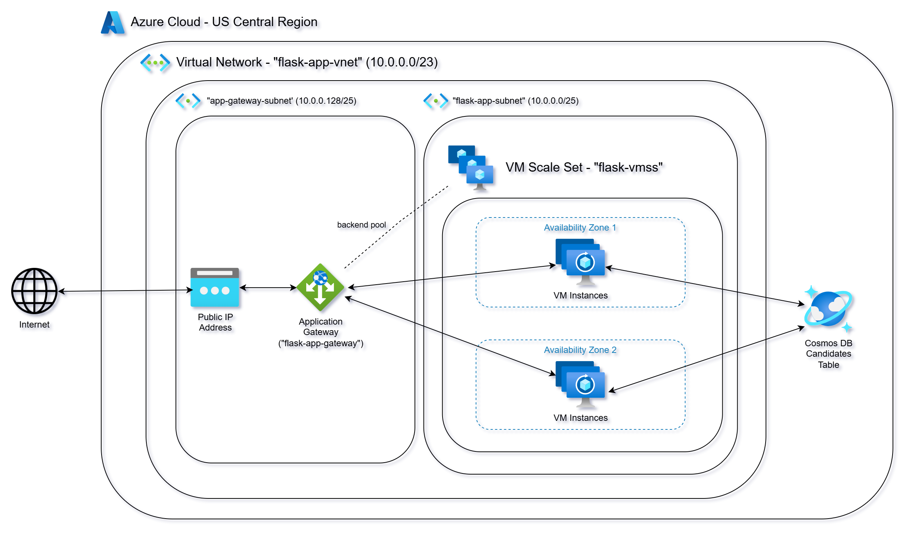
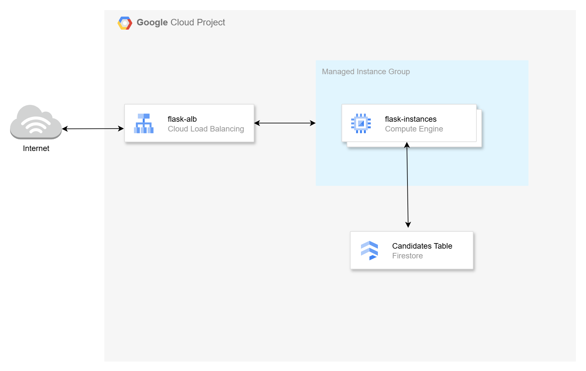

# Scaling in the Cloud: AWS Auto Scaling, Azure VMSS, and GCP MIGs

In this video series, we will explore deploying Flask-based microservices and implementing cloud-native scaling solutions across AWS, Azure, and Google Cloud Platform (GCP):

1. **Deploy Flask-based microservices** on virtual machines in AWS, Azure, and GCP.
2. **Use a document database** for microservice data storage:
   - **DynamoDB** for AWS
   - **CosmosDB** for Azure
   - **Firestore** for GCP
3. **Create machine images** of the deployed virtual machines using **Packer**.
4. **Implement cloud-native scaling solutions** with **Terraform**, tailored to each provider:
   - **Auto Scaling** for AWS
   - **Virtual Machine Scale Sets (VMSS)** for Azure
   - **Managed Instance Groups (MIGs)** for GCP
5. **Test scalability** by simulating load and triggering scaling events.
6. **Clean up resources** by destroying all infrastructure created during the process.
  
## Introduction to Scaling

AWS Auto Scaling, Azure Virtual Machine Scale Sets (VMSS), and Google Cloud Managed Instance Groups (MIGs) are cloud-native solutions designed to ensure scalability, fault tolerance, and efficiency for virtual machine workloads. They share the core purpose of automatically adjusting the number of virtual machines to meet demand.

**AWS Auto Scaling** excels in its deep integration with the AWS ecosystem, providing granular control over scaling policies and seamless compatibility with services like CloudWatch and Elastic Load Balancer. It supports dynamic scaling based on metrics, scheduled scaling, and predictive scaling, making it ideal for highly variable workloads, batch processing, and multi-region failover solutions. Auto-healing capabilities ensure instances are replaced automatically when issues arise, and configurations are defined using Launch Templates or Launch Configurations.

**Azure VM Scale Sets** are designed for enterprise-grade applications, particularly in environments already leveraging Azure's extensive suite of tools. They simplify the scaling and management of VMs, offering easy integration with Azure Load Balancer, Application Gateway, and Traffic Manager. Azure VMSS also supports advanced features like rolling upgrades and fault domain management, ensuring high availability. 

Google Cloud **Managed Instance Groups** provide a streamlined, globally scalable solution that integrates seamlessly with GCP’s innovative services like Cloud Monitoring and HTTP(S) Load Balancers. MIGs are particularly well-suited for distributed applications and microservices architectures, offering straightforward configuration and strong support for regional and global deployments. With features like automatic health checking, rolling updates, and support for preemptible VMs, GCP MIGs cater to modern, cost-sensitive cloud-native applications.

[Detailed Feature Comparison](./Comparison.md)

## Flask Endpoint Summary

- [AWS Source Code](https://github.com/mamonaco1973/aws-flask-asg/blob/main/02-packer/scripts/app.py)
- [Azure Source Code](https://github.com/mamonaco1973/azure-flask-vmss/blob/main/02-packer/scripts/app.py)
- [GCP Source Code](https://github.com/mamonaco1973/gcp-flask-mig/blob/main/01-packer/scripts/app.py)

### `/gtg` (GET)
- **Purpose**: Health check.
- **Response**: 
  - `{"connected": "true", "instance-id": <instance_id>}` (if `details` query parameter is provided).
  - 200 OK with no body otherwise.

### `/candidate/<name>` (GET)
- **Purpose**: Retrieve a candidate by name.
- **Response**: 
  - Candidate details (JSON) with status `200`.
  - `"Not Found"` with status `404` if no candidate is found.

### `/candidate/<name>` (POST)
- **Purpose**: Add or update a candidate by name.
- **Response**: 
  - `{"CandidateName": <name>}` with status `200`.
  - `"Unable to update"` with status `500` on failure.

### `/candidates` (GET)
- **Purpose**: Retrieve all candidates.
- **Response**: 
  - List of candidates (JSON) with status `200`.
  - `"Not Found"` with status `404` if no candidates exist.

## AWS Solution

## Azure Solution

## GCP Solution

